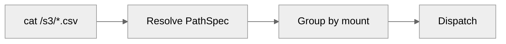
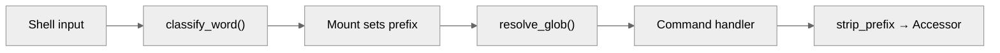

Commands are the concrete registration of <Icon icon="hand-sparkles" /> **[Gestures](/home/design/gestures)** in Mirage. Each registered command composes one or more <Icon icon="hand-point-up" /> **[Fingers](/home/design/fingers)** into a named, callable gesture: `cat` is a `read`, `ls` is a `readdir`, `cp` is `read` + `write`, `grep` is `read` + an in-process filter.

This page is the dispatch model: how a command gets looked up, how arguments flow through, and how to register a new one. The [Workspace](/home/design/workspace) is the kernel that stores and resolves commands; every registered command is a function that receives resolved paths and returns a byte stream.

## Dispatch

When a command is executed, mirage resolves it through these steps:



1. **Parse** - the shell layer expands variables and globs
2. **PathSpec resolution** - each path becomes a `PathSpec` with mount prefix, directory, and pattern
3. **Group by resource** - paths are grouped by their mount prefix
4. **Lookup** - the command registry finds the handler (see resolution order below)
5. **Dispatch** - the handler receives the accessor, `PathSpec` list, and parsed flags

### Command Resolution Order

For each command, the registry tries handlers in this order:

1. **Filetype-specific** - matched by file extension (e.g. `cat` for `.parquet` files uses a table renderer)
2. **Resource-specific** - matched by resource name without filetype (e.g. `cat` for S3)
3. **General** - resource-agnostic fallback shared across all resources

The Ops layer follows the same pattern for filesystem operations:
filetype-specific ops first, then resource ops without filetype.

When paths span multiple resources, the registry checks:

1. **Cross-mount handler** - registered for specific `(src, dst)` resource pairs (e.g. `cp` from S3 to RAM)
2. **Aggregator** - runs the command per resource and merges results (e.g. `cat`, `grep`)
3. **Error** - no cross-resource support for this command

## PathSpec Flow

A `PathSpec` is created at parse time and flows through the entire
dispatch chain, accumulating context at each stage:



| Stage | What happens | PathSpec state |
| --- | --- | --- |
| `classify_word()` | Creates PathSpec from shell token | `original="/s3/data/*.txt"`, `pattern="*.txt"`, `resolved=False` |
| `Mount.execute_cmd()` | Sets mount prefix on all paths | `prefix="/s3"` |
| `resolve_glob()` | Expands patterns against directory listing | Produces resolved PathSpecs per matched file |
| Command handler | Reads data via accessor | Uses `PathSpec` as-is |
| Core / Accessor | Strips prefix for resource call | `path.strip_prefix` → `"/data/file.txt"` |

The Ops layer and index cache also receive `PathSpec` - the index
cache uses `PathSpec.original` as its cache key.

## Registering a Command

Commands are registered with the `@command` decorator:

```python
@command("mycommand", resource="ram", spec=MY_SPEC)
async def mycommand(
    accessor,
    paths: list[PathSpec],
    *texts: str,
    stdin: ByteSource | None = None,
    **kwargs,
) -> tuple[ByteSource | None, IOResult]:
    data = await accessor.read(paths[0])
    return data, IOResult(reads={paths[0].original: data})
```

### Key parameters

| Parameter  | Description                                          |
| ---------- | ---------------------------------------------------- |
| `name`     | Command name (e.g. `"cat"`, `"grep"`)                |
| `resource` | Which resource(s) this command works with             |
| `spec`     | `CommandSpec` defining flags and operands             |
| `write`    | Set `True` if the command modifies files              |
| `aggregate`| Function for cross-resource result merging            |

### What commands receive

Commands receive fully resolved, fully expanded arguments. They have
no concept of variables, globs, cwd, or sessions - the pipeline
handles all of that before dispatch.

### What commands return

A tuple of `(ByteSource, IOResult)`:

- **ByteSource** - the output data (`bytes` or `AsyncIterator[bytes]`)
- **IOResult** - metadata: which paths were read, written, and should be cached

## Cross-Resource Dispatch

When a command receives paths spanning multiple mounts, mirage groups
paths by resource and dispatches accordingly.

### Read-Only Aggregation

Commands that read multiple files register an `aggregate` function.
Each path runs against its resource, then results are combined:

| Command | Aggregator         | Behavior                                 |
| ------- | ------------------ | ---------------------------------------- |
| `cat`   | `concat_aggregate` | Concatenate bytes                        |
| `head`  | `header_aggregate` | Add `==> path <==` headers between files |
| `tail`  | `header_aggregate` | Same headers                             |
| `grep`  | `prefix_aggregate` | Prefix each line with `path:`            |
| `wc`    | `wc_aggregate`     | Sum counts across files, add total line  |

### Cross-Mount Writes

Two-path commands that transfer data across resources use cross-mount
handlers:

| Command | Behavior                                       |
| ------- | ---------------------------------------------- |
| `cp`    | Read from source resource, write to destination |
| `mv`    | Copy then delete source                         |
| `diff`  | Read both, compare                              |

### Path Expansion

Globs expand within a single resource only:

- `cat /s3/*.txt` - expands within S3, single-resource dispatch
- `cat /s3/a.txt /github/b.txt` - explicit cross-resource, uses aggregator

Cross-resource operations only happen when paths from different
mounts are explicitly named.

## Supported Commands

### Standard Commands

| Category | Commands |
| -------- | -------- |
| File I/O | `cat`, `head`, `tail`, `tee`, `cp`, `mv`, `rm`, `mkdir`, `touch`, `ln`, `mktemp`, `split`, `csplit` |
| Search | `grep`, `rg`, `find`, `look` |
| Text Processing | `awk`, `sed`, `sort`, `uniq`, `cut`, `tr`, `paste`, `join`, `comm`, `column`, `fold`, `expand`, `unexpand`, `fmt`, `nl`, `rev`, `tac`, `shuf`, `tsort`, `wc` |
| Path Utilities | `ls`, `tree`, `stat`, `file`, `du`, `basename`, `dirname`, `realpath`, `readlink` |
| Data Formats | `jq`, `diff`, `cmp`, `patch` |
| Compression | `tar`, `zip`, `unzip`, `gzip`, `gunzip`, `zcat`, `zgrep` |
| Encoding | `base64`, `md5`, `sha256sum`, `xxd`, `iconv` |
| Math & Misc | `seq`, `expr`, `bc`, `date`, `strings`, `curl`, `wget` |

### Resource-Specific Commands

| Resource | Commands |
| -------- | -------- |
| Slack | `slack-post-message`, `slack-reply-to-thread`, `slack-add-reaction`, `slack-search`, `slack-get-users`, `slack-get-user-profile` |
| Discord | `discord-send-message`, `discord-add-reaction`, `discord-get-server-info`, `discord-list-members` |
| Telegram | `telegram-send-message` |
| Email | `email-send`, `email-read`, `email-reply`, `email-reply-all`, `email-forward`, `email-triage` |
| Gmail | `gws-gmail-send`, `gws-gmail-read`, `gws-gmail-reply`, `gws-gmail-reply-all`, `gws-gmail-forward`, `gws-gmail-triage` |
| Google Docs | `gws-docs-write`, `gws-docs-documents-create`, `gws-docs-documents-batchUpdate` |
| Google Sheets | `gws-sheets-read`, `gws-sheets-write`, `gws-sheets-append`, `gws-sheets-spreadsheets-create`, `gws-sheets-spreadsheets-batchUpdate` |
| Google Slides | `gws-slides-presentations-create`, `gws-slides-presentations-batchUpdate` |
| Linear | `linear-issue-create`, `linear-issue-update`, `linear-issue-transition`, `linear-issue-assign`, `linear-issue-add-label`, `linear-issue-set-priority`, `linear-issue-set-project`, `linear-issue-comment-add`, `linear-issue-comment-update`, `linear-search` |
| Notion | `notion-page-create`, `notion-block-append`, `notion-comment-add`, `notion-search` |
| Trello | `trello-card-create`, `trello-card-update`, `trello-card-move`, `trello-card-assign`, `trello-card-comment-add`, `trello-card-comment-update`, `trello-card-label-add`, `trello-card-label-remove` |
| Paperclip | `scan`, `search`, `map`, `lookup` |

### Command Availability by Resource

Full resources (all standard commands): **Disk**, **RAM**, **Redis**, **SSH**, **S3** (+ R2, GCS, OCI, Supabase)

| Command | Disk/RAM/Redis/SSH/S3 | GitHub | GDrive | Slack/Discord/Telegram | Email/Gmail | Linear/Notion/Trello | Langfuse | MongoDB |
| ------- | --------------------- | ------ | ------ | ---------------------- | ----------- | -------------------- | -------- | ------- |
| `ls` | ✓ | ✓ | ✓ | ✓ | ✓ | ✓ | ✓ | ✓ |
| `cat` | ✓ | ✓ | ✓ | ✓ | ✓ | ✓ | ✓ | ✓ |
| `head`/`tail` | ✓ | ✓ | ✓ | ✓ | ✓ | ✓ | ✓ | ✓ |
| `grep`/`rg` | ✓ | ✓ | ✓ | ✓ | ✓ | ✓ | ✓ | ✓ |
| `find` | ✓ | ✓ | ✓ | ✓ | ✓ | ✓ | ✓ | ✓ |
| `tree` | ✓ | ✓ | ✓ | ✓ | ✓ | ✓ | ✓ | ✓ |
| `stat` | ✓ | ✓ | ✓ | ✓ | ✓ | ✓ | ✓ | ✓ |
| `wc` | ✓ | ✓ | ✓ | ✓ | ✓ | ✓ | ✓ | ✓ |
| `jq` | ✓ | ✓ | ✓ | ✓ | ✓ | ✓ | ✓ | ✓ |
| `awk`/`sed`/`sort` | ✓ | ✓ | ✓ | | | | | |
| `cp`/`mv`/`rm` | ✓ | | | | | | | |
| `mkdir`/`touch`/`tee` | ✓ | | | | | | | |
| `diff`/`cmp` | ✓ | ✓ | ✓ | | | | | |
| `tar`/`zip`/`gzip` | ✓ | | | | | | | |
