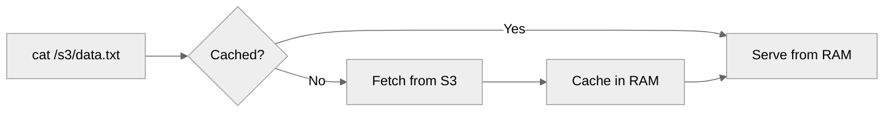

The File Store is one half of Mirage's <Icon icon="clock-rotate-left" /> [Recall](/home/design/recall) layer (the other is the [Index Store](/home/design/index_cache)). Running `cat /s3/data.parquet` costs something real: the <Icon icon="brain" /> **Brain** (the agent) orchestrates the chain and spends tokens, and the <Icon icon="hand" /> **[Hands](/home/design/hands)** make the network call, decode the format, and return bytes. The File Store keeps the bytes that came out of that work, so the next time the same request appears, Mirage returns the stored bytes directly. The network call, the decode, and the agent round-trip are all saved.

## What It Does

The file cache stores the byte output of file-touching commands in RAM the first time they run. When the same request appears later, Mirage returns those stored bytes directly. The <Icon icon="hand" /> **Hands** do not re-fetch or re-decode, and the <Icon icon="brain" /> **Brain** (Agent) does not spend tokens re-triggering the chain.



## How It Works

- **Cache hit** - Mirage checks whether every path the command touches is already cached. If all of them are, the command is served entirely from RAM. If any one is missing, the original resource handles the full command.
- **Cache miss** - the resource fetches the data. After execution, the result is cached.
- **Write invalidation** - any write to a path removes it from cache. The next request re-fetches from the resource.
- **LRU eviction** - when total cached bytes exceed the limit (default 512MB), the oldest entries are evicted.

## Opt-In Caching: Recall Is A Decision, Not A Default

Mirage does not cache eagerly. Each command declares which of its outputs are cacheable by populating `IOResult.cache` with the paths it wants preserved. A command that produces ephemeral or derived content can leave that list empty and nothing is stored.

This keeps Recall under the control of the <Icon icon="hand" /> **Hands** (and the <Icon icon="brain" /> **Brain** orchestrating them), not the filesystem layer. The cache is an opportunity the Hand decides to take, not a mandate imposed by the runtime.

```python
return IOResult(
    stdout=data,
    cache=[path],  # opt in: this path is worth remembering
)
```

### Caching by Intent

Today, Mirage makes this decision heuristically, based on what the command *intends*. `cat /s3/data.csv` is almost certainly a read the agent will want again, the bytes come back, the content is worth remembering, so `cat` opts in. A command like `stat`, whose output is metadata the index cache already tracks, does not. The rule of thumb: if the shape of the command suggests the bytes will be reused, cache; if it is a side-effecting or metadata-only call, skip.

This is deliberately simple for now. A future direction is to let the Brain itself annotate cacheability at call time (e.g., marking a particular `cat` as ephemeral), but the current default is that each Hand knows its own semantics and declares on its user's behalf.

## Background Drain

When `cat bigfile | head -n 1` runs, `head` returns after 1 line but the stream is partially consumed. A background task drains the remaining bytes and caches the full file, so the next read is a cache hit.

### Bounded Drains: `max_drain_bytes`

The drain is unbounded by default. A 10 GB file behind a one-line `head` will still be pulled in full to make the next read a cache hit. That is the right trade for most files but a bad one for very large objects the agent never asked for.

`max_drain_bytes` sets a per-drain ceiling. When a drain exceeds the ceiling without exhausting the source, the partial buffer is **discarded** and the path is **not** cached. The next read fetches fresh from the resource. It does not see a half-file. The ceiling applies independently to each drain task; it is not a workspace-wide pool.

```python
ws = Workspace(
    {"/gcs/": resource},
    cache=CacheConfig(max_drain_bytes=100_000_000),  # 100 MB ceiling
)
```

The setting is also mutable on the fly via `ws.max_drain_bytes`. Changing it affects subsequent drains; in-flight drains keep the budget they were started with.

```python
ws.max_drain_bytes = 1_000_000   # tighten to 1 MB
await ws.execute("cat /gcs/huge.jsonl | head -n 3")
# huge.jsonl drain trips the 1 MB ceiling → not cached

ws.max_drain_bytes = None        # back to unbounded
await ws.execute("cat /gcs/huge.jsonl | head -n 3")
# drain completes → huge.jsonl now cached
```

| `max_drain_bytes` | Drain behavior                                                              |
| ----------------- | --------------------------------------------------------------------------- |
| `None` (default)  | Always drain to completion. Cache populated regardless of size.             |
| `int`             | Drain until ceiling is exceeded. If exceeded without EOF, nothing is cached. |

## Freshness

Freshness is controlled by `ConsistencyPolicy`, a Workspace-level setting.

| Mode       | Behavior                                                                  |
| ---------- | ------------------------------------------------------------------------- |
| **LAZY** (default) | Cache hit = serve cached bytes. No remote check. Fast.            |
| **ALWAYS** | Before serving, call the backend's `stat` and compare `FileStat.fingerprint` against the cached fingerprint. If mismatch, evict and refetch. |

Under `ALWAYS`, each cached read costs one cheap round-trip (`HEAD` on S3, `stat` on disk, index lookup on GitHub). In exchange, the cache is guaranteed fresh against external mutation. Directory listings are not affected, they use the separate TTL-based [index cache](/home/design/index_cache).

### Backend fingerprint sources

| Backend                | Fingerprint source                | Notes                                                       |
| ---------------------- | --------------------------------- | ----------------------------------------------------------- |
| S3 / GCS / R2          | `ETag` from `HEAD`                | Changes on every content write.                             |
| Disk                   | `mtime` ISO string                | Changes on every local write.                               |
| GitHub                 | Blob `sha`                        | Changes on every commit that touches the blob.              |
| SSH (SFTP)             | `mtime` ISO string                | Same as disk.                                               |
| Google Drive           | `modifiedTime`                    | Reflects any edit, including Google-native format updates.  |
| RAM / Redis            |, (no fingerprint)                | Under ALWAYS, falls back to LAZY cleanly.                   |
| Slack / Discord / Notion / Linear / Telegram / Gmail / Google Docs/Sheets/Slides / Trello / MongoDB / Email |, (no cheap fingerprint) | Message-shaped backends. Under ALWAYS, falls back to LAZY.  |

Backends that return `stat.fingerprint is None` silently fall back to LAZY, so mixing fingerprint-capable and fingerprint-absent mounts under `ConsistencyPolicy.ALWAYS` is safe.

### Current implementation note

The cache's default per-entry fingerprint is `md5(bytes)` (auto-computed at `cache.set` time when a command does not supply one). For S3/GitHub this matches the backend's content-derived fingerprint, cache hits under ALWAYS are efficient. For disk/SSH/GDrive the cached fingerprint is `md5(bytes)` while the backend returns a time-based fingerprint; the two never compare equal, so ALWAYS refetches on every read. This is correct but inefficient; a follow-up can align the two by propagating `FileStat.fingerprint` through `IOResult` at cache-set time.

## Storage Backends

| Backend | Use case            |
| ------- | ------------------- |
| RAM     | Default, in-process |
| Disk    | Persistent local    |
| Redis   | Multi-process       |
