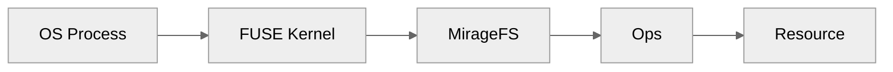

## Overview

FUSE is part of the <Icon icon="hand-point-up" /> **[Fingers](/home/design/fingers)** layer alongside [Ops](/home/design/vfs). Where Ops dispatch fingers inside Mirage, FUSE exposes the same fingers to the host OS through a real mount point. Once mounted, any process, shells, editors, scripts, can act against mounted resources through standard POSIX file I/O, using the same fingers every [Gesture](/home/design/gestures) is built on.

The mount runs in a background thread and is automatically
cleaned up when the Workspace closes.

## How It Works

`MirageFS` implements FUSE operations by delegating to the Ops layer:

| FUSE Call  | Ops Call     | Description                   |
| ---------- | ------------ | ----------------------------- |
| `getattr`  | `stat`       | File metadata                 |
| `readdir`  | `readdir`    | Directory listing             |
| `read`     | `read`       | Read file content             |
| `write`    | `write`      | Write with buffering          |
| `create`   | `create`     | Create new file               |
| `mkdir`    | `mkdir`      | Create directory              |
| `unlink`   | `unlink`     | Delete file                   |
| `rmdir`    | `rmdir`      | Remove directory              |
| `rename`   | `rename`     | Move or rename                |
| `truncate` | `truncate`   | Truncate file                 |

## Virtual Directories

FUSE creates virtual directories from mount prefixes. The directory
`/s3/` doesn't physically exist - it's synthesized from the mount
table so that `ls /tmp/mirage-xxx/` shows all mounted prefixes.

## Write Buffering

Writes are buffered per file handle. Data is flushed to the resource
on `flush` or `release` (file close), reducing the number of API calls
for sequential writes.

## Special Files

FUSE provides `/.mirage/whoami` which returns metadata about the
current agent, working directory, and mounted prefixes.

## Platform Notes

- **macOS:** Requires macFUSE. Metadata files (`.DS_Store`, `._*`,
  `.Spotlight-V100`) are automatically filtered.
- **Linux:** Uses `fusermount`. No special filtering needed.

FUSE is optional - mirage works without it for Python-only and
virtual shell execution.
