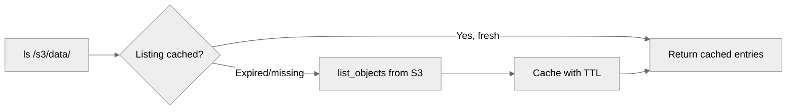
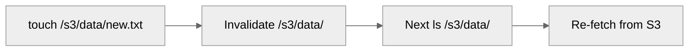

The Index Store is one half of Mirage's <Icon icon="clock-rotate-left" /> [Recall](/home/design/recall) layer (the other is the [File Store](/home/design/file_cache)). It remembers *directory listings and metadata* that the <Icon icon="eye" /> **[Eyes](/home/design/eyes)** have already seen, so `ls`, `stat`, and glob expansion don't trigger network calls on every use.

## What It Does

The index cache stores directory listings and file metadata from remote resources. Without it, every `ls`, glob expansion, or `stat` call triggers a network request.

## What It Caches

- **Directory listings**, children of a directory with metadata
- **File metadata**, name, type, size, timestamps

This enables fast `stat` lookups. If the parent directory is cached, mirage knows instantly whether a file exists without a network call.

## TTL Per Resource

| Resource  | TTL  | Reason                                    |
| --------- | ---- | ----------------------------------------- |
| RAM       | 0s   | In-process, always fresh                  |
| Disk      | 60s  | Local changes are fast to detect          |
| S3/GCS/R2 | 600s | API calls are slow and costly             |
| GitHub    | 600s | Repo tree rarely changes within a session |

After TTL expires, the next directory read re-fetches from the resource.

### Why TTL, Not Fingerprints

A directory listing is a *collection*, not a single blob, and resources do not expose a cheap "did this directory change?" fingerprint. The only way to verify staleness is to re-run `list_objects_v2`, which is the call you were trying to cache in the first place. TTL is a time-based bet instead: assume nothing changed for N seconds. The cost of being wrong is bounded. A newly-created file is invisible for at most N seconds, then the listing re-fetches.

## Invalidation

Writes invalidate the **parent directory listing** only:

## Storage Backends

| Backend | Use case            |
| ------- | ------------------- |
| RAM     | Default, in-process |
| Redis   | Multi-process       |
