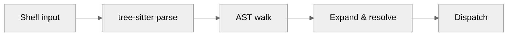

The Shell is the wiring inside Mirage's [Arm](/home/design/arm), between agents, [Eyes](/home/design/eyes), and [Hands](/home/design/hands). When an agent types `cat /s3/*.csv | grep error`, the Shell figures out which paths the Eyes need to look at, which Hands to use, and in what order, turning a sentence into coordinated execution.

Under the hood, Mirage includes a shell execution layer that parses and runs commands using tree-sitter-bash. It handles variable expansion, control flow, pipes, and dispatches to registered command handlers.

## Flow



1. **Parse** - tree-sitter-bash produces an AST from the input string
2. **Walk** - the executor walks AST nodes, routing each to the appropriate handler
3. **Expand** - variables (`$VAR`, `${VAR:-default}`), command substitution (`$(cmd)`), and arithmetic (`$((expr))`) are expanded
4. **Resolve** - paths become `PathSpec`, globs are expanded
5. **Dispatch** - the command registry finds the handler and executes it

## Two-Layer Design

### Shell layer

Handles anything that requires session state or control flow:

| Responsibility     | Examples                        |
| ------------------ | ------------------------------- |
| Variable expansion | `$FOO`, `${FOO:-default}`       |
| Path resolution    | `./file` → `/mirage/data/file`  |
| Glob expansion     | `*.csv` → `a.csv b.csv`        |
| Control flow       | `&&`, `||`, `;`, `|`, `&`       |
| Shell builtins     | `cd`, `export`, `echo`, `test`  |

### Command layer

Handles stateless data transformation:

| Responsibility    | Examples                    |
| ----------------- | --------------------------- |
| File processing   | `cat`, `head`, `grep`       |
| Format conversion | parquet → text              |
| Data search       | `find`, `grep -r`           |

Commands receive fully resolved arguments - they have no concept of
variables, globs, or sessions.

## Shell Features

### Pipes & Redirection

| Feature | Example |
| ------- | ------- |
| Pipe | `cmd1 \| cmd2` |
| Stderr pipe | `cmd \|& cmd2` |
| Redirect stdout | `cmd > file`, `cmd >> file` |
| Redirect stderr | `cmd 2> file`, `cmd 2>&1` |
| Redirect both | `cmd &> file` |
| Stdin from file | `cmd < file` |
| Heredoc | `cmd <<EOF` |
| Herestring | `cmd <<< "text"` |
| Process substitution | `cmd <(other_cmd)` |

### Control Flow

| Feature | Example |
| ------- | ------- |
| AND / OR | `cmd1 && cmd2`, `cmd1 \|\| cmd2` |
| Sequential | `cmd1 ; cmd2` |
| If/elif/else | `if cmd; then ...; elif ...; else ...; fi` |
| For loop | `for x in a b c; do ...; done` |
| While / Until | `while cmd; do ...; done` |
| Case | `case $x in pat) ...;; esac` |
| Subshell | `(cmd1; cmd2)` |
| Group | `{ cmd1; cmd2; }` |
| Background | `cmd &` |
| Negate | `! cmd` |

### Variable Expansion

| Feature | Example |
| ------- | ------- |
| Simple | `$VAR`, `${VAR}` |
| Default value | `${VAR:-default}` |
| Special vars | `$?`, `$#`, `$@`, `$*`, `$0`, `$1`..`$9` |
| Command substitution | `$(cmd)` |
| Arithmetic | `$((a + b))` |

### Functions

```bash
greet() {
    local prefix=">>>"
    echo "$prefix $1"
}
greet Alice
```

Functions support `local` variables, positional parameters (`$1`, `$@`),
`shift`, `return`, and a per-call call stack.

## Builtins

| Builtin | Description |
| ------- | ----------- |
| `cd` | Change working directory |
| `pwd` | Print working directory |
| `export` | Set environment variable |
| `unset` | Remove environment variable |
| `printenv` | Print environment |
| `echo` | Print text |
| `printf` | Formatted output |
| `test` / `[` / `[[` | Conditional expressions |
| `read` | Read line from stdin into variable |
| `local` | Declare function-scoped variable |
| `set` | Set positional parameters |
| `shift` | Remove first positional parameter |
| `source` / `.` | Execute script in current session |
| `eval` | Evaluate string as command |
| `return` | Return from function |
| `break` / `continue` | Loop control |
| `true` / `false` | Exit with 0 / 1 |
| `sleep` | Sleep for N seconds |
| `python` | Execute Python code |
| `xargs` | Build and execute commands from stdin |
| `timeout` | Run command with time limit |
