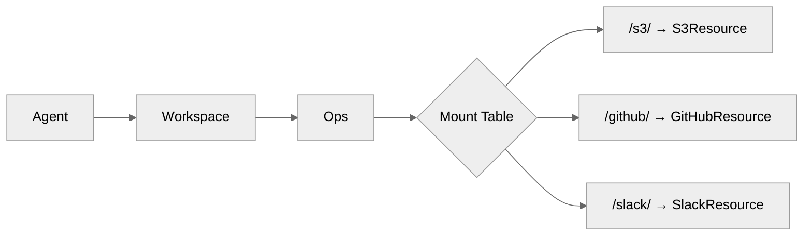

The Ops layer is mirage's resource-agnostic dispatch layer. It maintains a mount table mapping path prefixes to resources and routes every file operation to the correct backend.

## Mount Table

Mounts are sorted by prefix length (longest first), so overlapping
prefixes resolve correctly. A path like `/s3/data/file.txt` resolves
to the S3 resource with relative key `data/file.txt`.

## Path Resolution

Each virtual path is resolved to:

- **Mount point** - the matching prefix
- **PathSpec** - carries the original path, prefix, and resource-relative key via `strip_prefix`
- **Accessor** - the resource's data access layer
- **Cache store** - the resource's cache backend
- **Mount mode** - READ, WRITE, or EXEC

## Operations

| Operation   | Description                              |
| ----------- | ---------------------------------------- |
| `read`      | Read file content (supports range reads) |
| `write`     | Write data to a file                     |
| `stat`      | Get file metadata (size, type, mtime)    |
| `readdir`   | List directory contents                  |
| `mkdir`     | Create a directory                       |
| `unlink`    | Delete a file                            |
| `rmdir`     | Remove a directory                       |
| `rename`    | Move or rename a file                    |
| `create`    | Create a new empty file                  |
| `truncate`  | Truncate a file to zero bytes            |
| `append`    | Append data to a file                    |

## Concurrency

Each path gets its own async lock to prevent cache corruption during
concurrent reads and writes. Operations on different paths run in
parallel; operations on the same path are serialized.

## File Type Detection

The Ops layer detects file types from extensions and delegates to
type-specific handlers. For example, reading a `.parquet` file
returns a formatted table rather than raw bytes.
